 

 

## About me

- 🎓 Multimedia graduate, currently an honours student in Software Engineering
- 💻 Frontend-leaning software engineer — I like clean UI and code that reads well
- 🌱 Always learning something new
- 🚀 Open to interesting projects and collaborations

 

## Tech stack

 

  

 
## Contribution snake 🐍

<!--START_SECTION:snake-->

<!--END_SECTION:snake-->

 

## Let's connect

 

