<!-- ===================================================== -->
<!--                     TECH STACK                        -->
<!-- ===================================================== -->

 

◈ SELECT A CATEGORY TO EXPLORE MY STACK ◈

  

<!-- ===================== TIER 01 ===================== -->

  

 

  

<!-- ===================== TIER 02 ===================== -->

  

  

<!-- ===================== TIER 03 ===================== -->

  

 

  

 

  

<!-- ===================================================== -->
<!--                  STACK DIRECTORY                      -->
<!-- ===================================================== -->

### `◈ STACK DIRECTORY ◈`

Click a category below to reveal the full inventory

 

<!-- ===================== LANGUAGES ===================== -->

<b>💜 01 // LANGUAGES</b>

 

`JavaScript` • `TypeScript` • `C#` • `Java` • `Python`

`PHP` • `Rust` • `HTML5` • `CSS3` • `SQL`

 

<!-- ===================== FRAMEWORKS ===================== -->

<b>⚡ 02 // FRAMEWORKS & LIBRARIES</b>

 

`React` • `Next.js` • `Angular`

`Node.js` • `Express.js` • `React Native`

`Tailwind CSS` • `Bootstrap` • `Sass`

 

<!-- ===================== TOOLS ===================== -->

<b>🛠️ 03 // TOOLS & PLATFORMS</b>

 

**DEVELOPMENT**

`Git` • `GitHub` • `VS Code` • `Visual Studio`

`Postman` • `Webpack` • `Jest` • `Vercel`

 

**DATABASE**

`MongoDB` • `MongoDB Compass` • `MySQL` • `PostgreSQL`

 

**DESIGN**

`Figma` • `Canva` • `Photoshop` • `Illustrator`

 

**OTHER TOOLS**

`CodePen` • `Prezi`

`Word` • `Excel` • `PowerPoint`

`Outlook` • `Teams` • `OneDrive` • `SharePoint`

 

<!-- ===================================================== -->
<!--                 WORLD OF AKIRAH                       -->
<!-- ===================================================== -->

 

 

