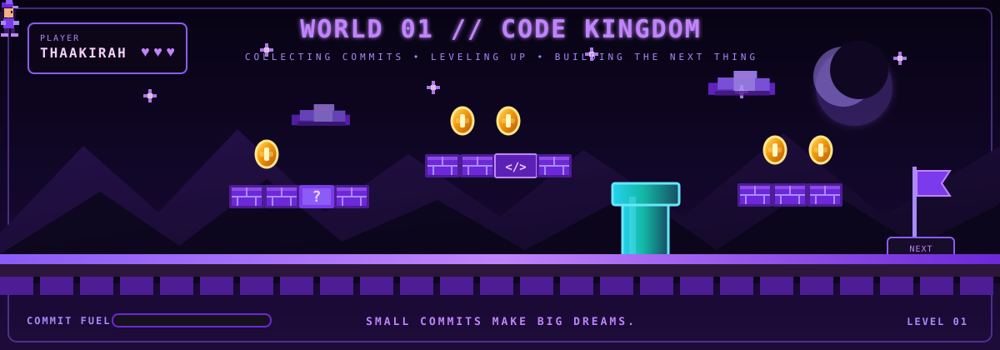

<!-- ===================================================== -->
<!--                      HERO                             -->
<!-- ===================================================== -->

<div align="center">
  
</div>


<!-- ===================================================== -->
<!--                    ABOUT ME                           -->
<!-- ===================================================== -->

## 👩🏽‍💻 About Me

🎓 ICT graduate specialising in **Frontend Development** & currently an **Honours student in Software Engineering**

💻 Experience across **Frontend, Full-Stack and Backend Development**

🌱 Constantly learning, experimenting and improving my craft

🚀 Open to **interesting projects, collaborations and new ideas**

<br>

<!-- ===================================================== -->
<!--                 HEADER                                 -->
<!-- ===================================================== -->

<div align="center">


<!-- ===================== TIER 01 : LANGUAGES ====================== -->


<br>

<br>


<!-- ===================== TIER 02 : FRAMEWORKS ====================== -->


<br>


<!-- ===================== TIER 03 : TOOLS & PLATFORMS ====================== -->


<br>

<br>

<br>


<br>


<!-- ===================================================== -->
<!--              WORLD 01 // CODE KINGDOM                -->
<!-- ===================================================== -->

<div align="center">



<br>


&nbsp;

&nbsp;

&nbsp;


<br><br>

<sub>
  <code>SMALL COMMITS MAKE BIG DREAMS // LEARN • CODE • BUILD • REPEAT</code>
</sub>

<br><br>

</div>


<!-- ===================================================== -->
<!--                       THE END                         -->
<!-- ===================================================== -->

<div align="center">

<br>


<br>

<sub>
  <code>PLAYER THAAKIRAH // SAVE COMPLETE // NEW ADVENTURES AHEAD</code>
</sub>

<br><br>


&nbsp;

&nbsp;


<br><br>


</div>
```


